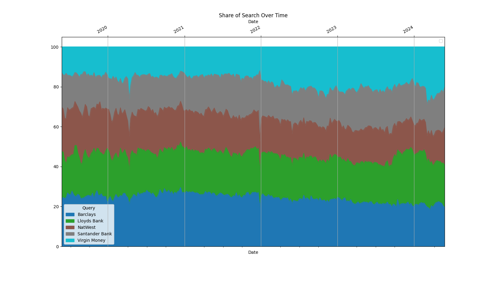
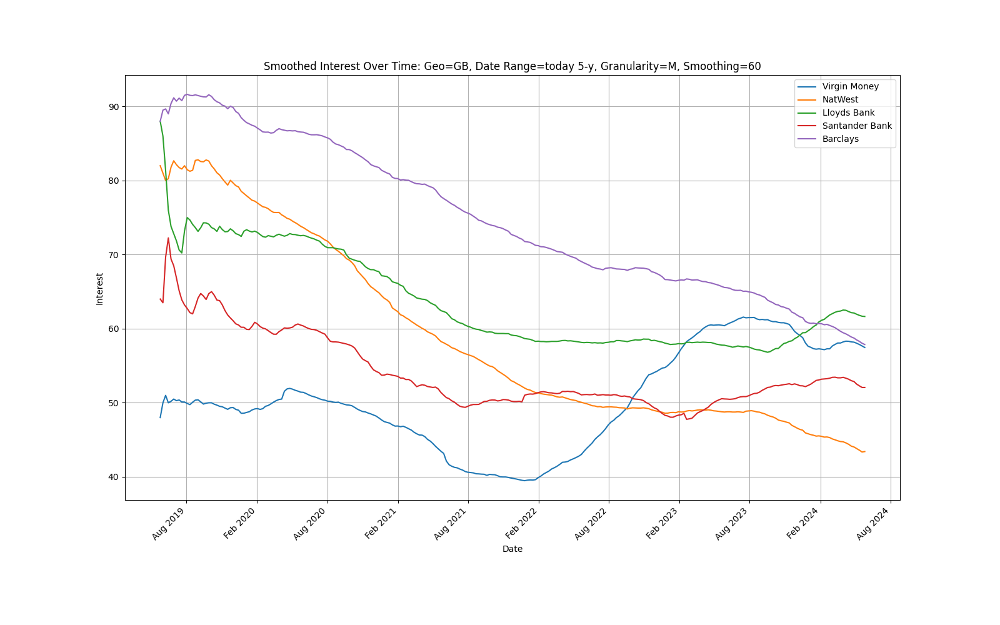
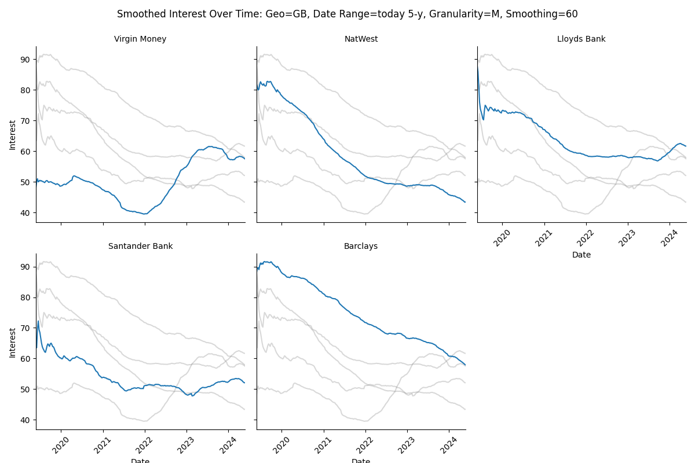
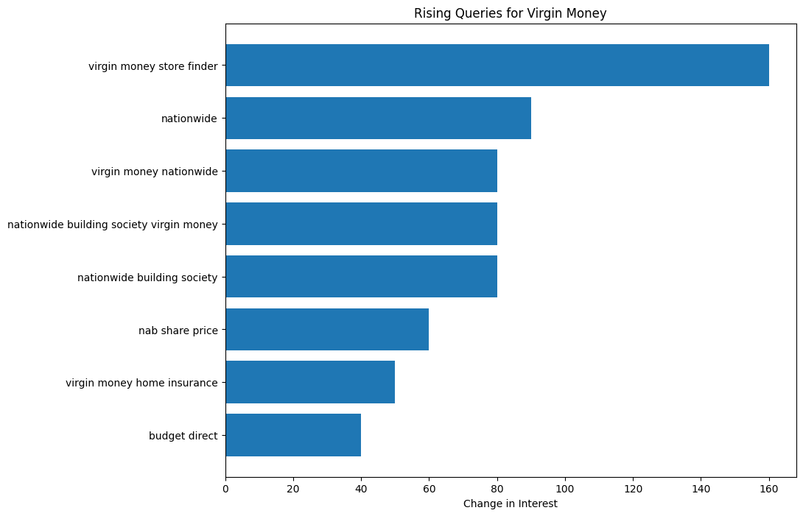
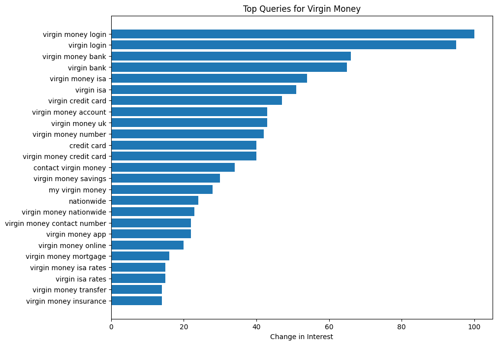
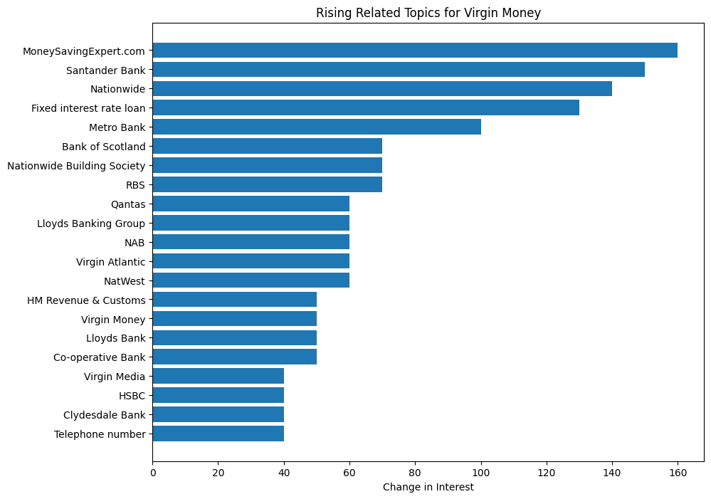
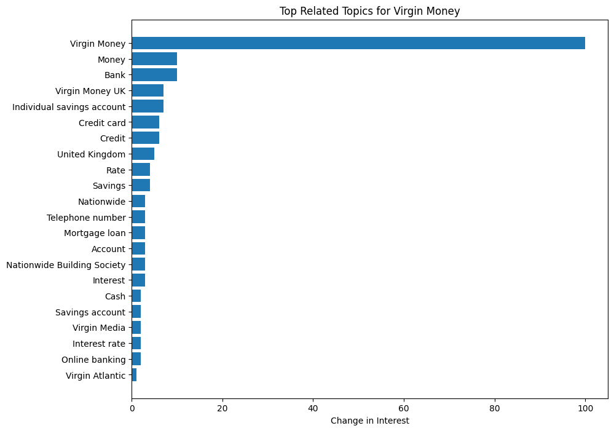

.jpg)

# Share of Search Tool

## Description

The **Share of Search** tool leverages Google Trends data via SerpAPI to provide insights into search interest over time for specified queries. Designed for market analysts, marketers, and researchers, this tool facilitates understanding of market trends, competition, and relative popularity of keywords within specific geographical areas.

## Features

- **Multi-Query Analysis**: Supports analysis of up to five search terms simultaneously.
- **Comparative Insights**: Provides comparative views of search interest over customizable date ranges.
- **Smoothed Trends Visualization**: Offers visualizations of smoothed search trends to reveal underlying patterns more clearly.
- **CSV Data Export**: Enables automatic generation and saving of search data into CSV format for offline analysis.
- **Flexible Date Range Parsing**: Accommodates a variety of date specifications, including absolute ranges and relative periods.

## Access the Jupyter Notebook

For an interactive experience, access the Jupyter workbook hosted on Colab:

[Share of Search Notebook](https://colab.research.google.com/drive/1OBzWJO5uASpNU1_aoKyxbAhSVfUzt9mq#scrollTo=WoaCBiuFsMcW)

## Setup Instructions

### Prerequisites

Ensure Python and pip are installed on your machine. Install the required libraries using:

```python
!pip install -q serpapi pandas matplotlib seaborn
```

## Usage
### Configuration
Configure the tool with your desired queries and settings:

```python
queries = ["Virgin Money", "Lloyds Bank", "Barclays", "Santander Bank", "NatWest"]
geo = "GB"  # Geographic location set to Great Britain
date = "today 5-y"  # Default timeframe set to the last 5 years
SMOOTHING_PERIOD = 6 # This change adjusts the smoothing window to 6 months,
# allowing the data to reflect a shorter-term trend. 

# Using the API to fetch data:
# Google Trends does not provide absolute values for the number of search queries,
# but relative search volumes (RSV). 
# The relative search volumes are normalised to the highest value, which is set to 100.
# The popularity of up to 5 search terms or search topics can be compared directly. 
```

## Running the Tool
Execute the script to fetch the data, visualize the trends, and save the outputs:

```python
python share_of_search.py
```

## View Results
Check the generated plots and CSV files for insights into the search trends of your specified queries.

## Example outputs

<div style="display: flex; justify-content: space-between;">
  
  
  
</div>

<div style="display: flex; justify-content: space-between;">
  
  
</div>

<div style="display: flex; justify-content: space-between;">
  
  
</div>

## Contributing
Contributions are welcome! If you have suggestions for improving this tool, please feel free to make a pull request or open an issue.

## Authors
Charles Shaw charles.shaw@tandpgroup.com

## Copyright Notice
This tool is the proprietary and confidential property of T&P𝑚. Unauthorized copying, distribution, modification, or use in any manner is strictly prohibited without express permission from T&P𝑚.
